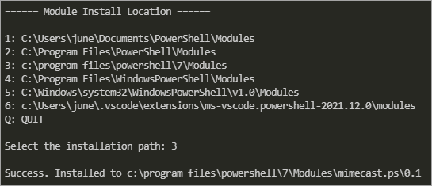

# MIMECAST.PS

 This project is a PowerShell module wrapper for the [Mimecast API](https://integrations.Mimecast.com/documentation/api-overview/).

 This module is a work in progress and only has a few functions included for now.

## Table of Contents<!-- omit in toc -->

- [Release Notes](#release-notes)
- [How To Install](#how-to-install)
- [Module Functions](#module-functions)
  - [Common Parameters](#common-parameters)
- [Deployment and Usage Guide](#deployment-and-usage-guide)

## Release Notes

Go to [Release Notes](release_notes.md).

## How To Install
1. Download or clone the [main repository](https://github.com/junecastillote/MIMECAST.PS).
2. Open PowerShell as admin.
3. Change the working directory to where you downloaded the module.
4. Run `.\installme.ps1`

   

## Module Functions

Below is the list of the public commands so far in this version. Click each command link to view individual documentation.

* [`Get-mcGroup`](docs/function/Get-mcGroup.md) - Get all or top *n* groups from the Mimecast directory.
* [`Get-mcGroupById`](docs/function/Get-mcGroupById.md) - Get the group information with the specific group ID.
* [`Get-mcGroupMember`](docs/function/Get-mcGroupMember.md) - Get the members the Mimecast groups.
* [`Send-mcMailMessage`](docs/function/Send-mcMailMessage.md) - Send email via Mimecast.
* [`New-mcGroupBackup`](docs/function/New-mcGroupBackup.md) - Create an export the groups (CSV) and group members (JSON). This command wraps the `Get-mcGroup`, `Get-mcGroupById`, `Get-mcGroupMember`, and `Send-mcMailMessage` altogether.

### Common Parameters

> Note: All requests to Mimecast require authentication. As such, all commands will have five (5) common parameters related to authentication and request endpoint.

* `-appId`

  The **Application ID** value of your Mimecast registered application. This parameter is mandatory and must be a **secure string** object.

* `-accessKey`

  The Access Key value of your Mimecast registered application. This parameter is mandatory and must be a **secure string** object.

* `-secretKey`

  The Secret Key value of your Mimecast registered application. This parameter is mandatory and must be a **secure string** object.

* `-appKey`

  The Application Key value of your Mimecast registered application. This parameter is mandatory and must be a **secure string** object.

* `-Region`

  Your Mimecast region. The valid regions are `eu`, `de`, `us`, `ca`, `za`, `au`, `offshore`. If not specified, the default value is `us`.

> Note: Because the Application ID, Access Key, Secret Key, and Application Key are confidential values, they must be made into secure strings and not plain text. Which method to use will be up to you. The most recommended is to use the ***PowerShell Secret Management Module and Secret Store***.

Reference: [PowerShell Encrypt Password Command via Secret Management Module](https://adamtheautomator.com/powershell-encrypt-password)

## Deployment and Usage Guide

* [Mimecast Groups Backup Deployment Guide](docs/guide/MimecastGroupsBackupDeploymentGuide.md)
