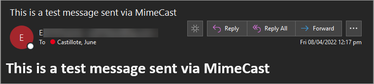

# Send-mcMailMessage

Send email via Mimecast

## Table of Contents<!-- omit in toc -->

- [SYNTAX](#syntax)
- [PARAMETERS](#parameters)
- [EXAMPLES](#examples)
  - [Example 1: Send a Message](#example-1-send-a-message)
- [Response Object](#response-object)
  - [Sample Email](#sample-email)
  - [Sample Output](#sample-output)
  - [Properties](#properties)
- [References](#references)

## SYNTAX

```PowerShell
Send-mcMailMessage `
    [-accessKey] <securestring> `
    [-secretKey] <securestring> `
    [-appId] <securestring> `
    [-appKey] <securestring> `
    [[-Region] <string>] `
    [[-From] <string>] `
    [-To] <string[]> `
    [[-Cc] <string[]>] `
    [[-Bcc] <string[]>] `
    [-Subject] <string> `
    [-Body] <string> `
    [<CommonParameters>]
```

## PARAMETERS

* `-appId`

  The **Application ID** value of your Mimecast registered application. This parameter is mandatory and must be a **secure string** object.

* `-accessKey`

  The Access Key value of your Mimecast registered application. This parameter is mandatory and must be a **secure string** object.

* `-secretKey`

  The Secret Key value of your Mimecast registered application. This parameter is mandatory and must be a **secure string** object.

* `-appKey`

  The Application Key value of your Mimecast registered application. This parameter is mandatory and must be a **secure string** object.

* `-Region`

  Your Mimecast region. The valid regions are `eu`, `de`, `us`, `ca`, `za`, `au`, `offshore`. If not specified, the default value is `us`.

* `-From`

  (OPTIONAL) Specifies the sender's email address. If not specified, the default email address associated with the authentication profile will be used.

* `-To`

  (REQUIRED) Specifies one (single string) or more (array) TO recipients` email addresses.

* `-Cc`

  (OPTIONAL) Specifies one (single string) or more (array) CC recipients` email addresses.

* `-Bcc`

  (OPTIONAL) Specifies one (single string) or more (array) BCC recipients` email addresses.

* `-Subject`

  (REQUIRED) The message subject.

* `-Body`

  (REQUIRED) The HTML format message.


## EXAMPLES

### Example 1: Send a Message

```PowerShell
# Create the confidential keys splat
$keys = @{
    appId = "secure application id"
    accessKey = "secure access key"
    secretKey = "secure secret key"
    appKey = "secure application key"
}

$mail = @{
  To = @('june.castillote@gmail.com','security@lzex.ml')
  #Cc = @()
  #Bcc = @()
  Subject = "This is a test message sent via MimeCast"
  Body = "<h1>This is a test message sent via MimeCast</h1>"
}

Send-mcMailMessage @keys @mail
```

## Response Object

### Sample Email



### Sample Output

```
meta : @{status=200}
data : {@{messageId=<Mimecast.1533.1800763b993@us-sl-69.us.Mimecast.lan>; messageDateHeader=Fri, 08 Apr 2022 00:16:57 -0400}}
fail : {}
```

### Properties

* `meta` - Contains the status code.
* `data` - If the email sending was successful, this property contains the message details such as the `messageId` and `messageDateHeader=`.
* `fail` -  If the email sending was unsuccessful, this property would contain the error details.

## References

* [Send-Email (Mimecast API)](https://integrations.Mimecast.com/documentation/endpoint-reference/email/send-email/)
* [About Splatting](https://docs.microsoft.com/en-us/powershell/module/microsoft.powershell.core/about/about_splatting)