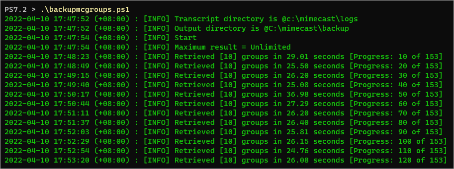
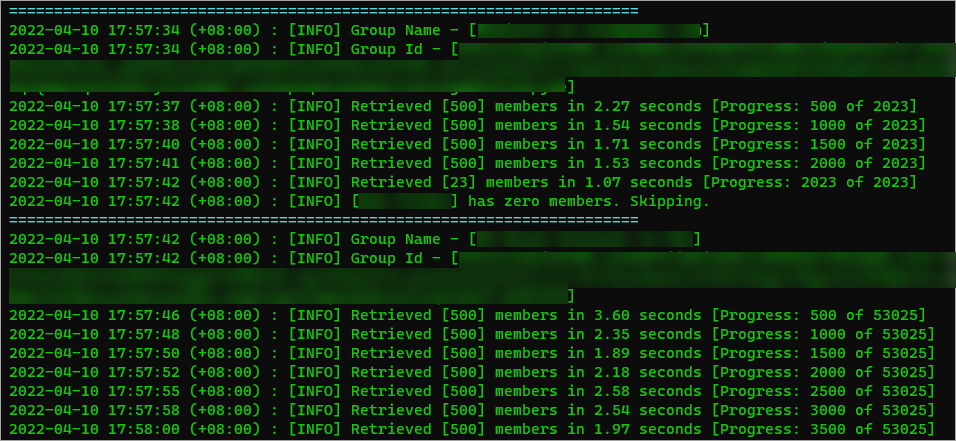
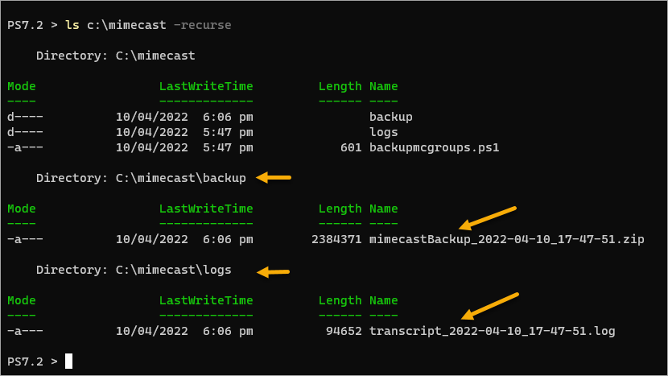
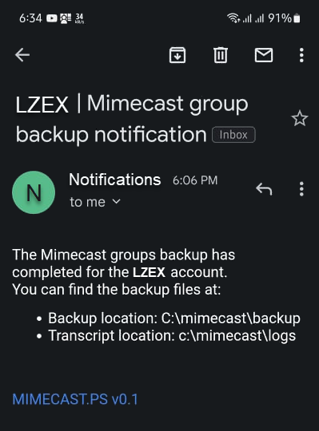

# Mimecast Groups Backup Deployment Guide

This module includes a function called [`New-mcGroupBackup`](/docs/New-mcGroupBackup.md) that retrieves groups and group members from Mimecast. The retrieved objects are exported to CSV (groups) and JSON (group members) files.

The backup process also compresses the output files by default (which can be disabled) and sends an optional backup completion notification.

## Table of Contents<!-- omit in toc -->

- [Requirements](#requirements)
- [Securing the Mimecast API Keys](#securing-the-mimecast-api-keys)
- [Testing the Secured Keys](#testing-the-secured-keys)
- [Things to Consider Before Configuring the Mimecast Group Backup](#things-to-consider-before-configuring-the-mimecast-group-backup)
- [Deploying the Backup Script](#deploying-the-backup-script)
  - [Create the Backup Script](#create-the-backup-script)
  - [Test the Backup Script](#test-the-backup-script)
  - [Sample Output](#sample-output)
  - [Sample Email Notification](#sample-email-notification)
  - [Schedule the Backup](#schedule-the-backup)

## Requirements

* [Install the MIMECAST.PS module](../../README.md#how-to-install) before anything else.
* You must have already [registered an application](https://community.Mimecast.com/s/article/Managing-API-Applications-505230018) in Mimecast. You'll need the following information.
  * Application ID
  * Application Key
  * Access Key
  * Secret Key
* The deployment computer should have a minimum of *Windows PowerShell 5.1*, but [PowerShell 7+](https://docs.microsoft.com/en-us/powershell/scripting/install/installing-powershell?view=powershell-7.2) is better. This module has been tested with both versions.


## Securing the Mimecast API Keys

For security reasons, every function in this module that interacts with Mimecast requires the API keys to be secured. The keys cannot be in plain text. The method of securing API keys should be up to you (the implementer). There are many options available, like, [`Export-CliXml`](https://atablog.hashnode.dev/export-clixml-and-import-clixml-saving-objects-to-xml) and [Azure Key Vault](https://docs.microsoft.com/en-us/azure/key-vault/general/basic-concepts). The choice is yours.

This guide will be using the PowerShell [Secret Management Module](https://docs.microsoft.com/en-us/powershell/module/microsoft.powershell.secretmanagement/?view=ps-modules) and [Secret Store](https://docs.microsoft.com/en-us/powershell/module/microsoft.powershell.secretstore/?view=ps-modules) to create a secured hashtable secret.

Reference: [PowerShell Encrypt Password Command via Secret Management Module](https://adamtheautomator.com/powershell-encrypt-password)

1. Open an elevated PowerShell session (run as administrator).
2. Install the required modules (if not installed yet).
   ```PowerShell
   Install-Module -Name Microsoft.PowerShell.SecretManagement, Microsoft.PowerShell.SecretStore -Scope AllUsers
   ```
   > Note: If you plan to run the script using a service account for automation, you must open a new PowerShell session as the service account now before proceeding with the next step.

3. Create a new *Secret Vault*. You can specify any name you prefer for the vault. This example creates a secret vault name `script_secrets`

   ```PowerShell
   Register-SecretVault -Name script_secrets -ModuleName Microsoft.PowerShell.SecretStore -Description 'This vault contains the credentials and secrets used for automation scripts'
   ```

4. Create the Mimecast API keys secret. Make sure to replace the `appId`, `accessKey`, `secretKey`, and `appKey` accordingly.

   ```PowerShell
   Set-Secret -Name mimecast_api -Secret `
      @{
         accessKey = 'access key'
         secretKey = 'secret key'
         appId     = 'application id'
         appKey    = 'application key'
      }
   ```

   When asked to create a password for the secret vault, type in a password and press Enter. ***DO NOT FORGET THIS MASTER PASSWORD***.

5. Set the vault configuration to not require a password so that you can use it for unattended automation scripts. Enter the vault's master password when prompted.

   ```PowerShell
   Set-SecretStoreConfiguration -Authentication None -Interaction None -Confirm:$false
   ```

   > Note: After this step, the vault will no longer require you to enter a password before you can access the secrets it contains. Only the user account that created the vault and secret can access them.

6. Confirm that the `mimecast_api` secret now exits inside the `script_secrets` vault.

   ```PowerShell
   Get-Secret -Name mimecast_api -Vault script_secrets
   ```

   And you should get the below result. You have now secured the Mimecast API keys.

   ```
   Name                           Value
   ----                           -----
   secretKey                      System.Security.SecureString
   appId                          System.Security.SecureString
   accessKey                      System.Security.SecureString
   appKey                         System.Security.SecureString
   ```

   > Note: If you want to see the actual secrets values, append the `-AsPlainText` switch to the command.

## Testing the Secured Keys

The quickest way to test if the API keys work with the module is by running the `Get-mcAccount` command. This command retrieves the Mimecast account information.

```PowerShell
# Get Mimecast secret from the secret vault
$mimecastkeys = Get-Secret -Vault script_secrets -Name mimecast_api

# Retrieve the Mimecast account information
$mcAccount = Get-mcAccount @mimecastkeys

# Display the account information
$mcAccount.data
```

If the command was successful, you should get an output similar to the one below.

```
region                          : us
archive                         : False
gateway                         : True
passphrase                      :
supportCode                     : XXXX
maxRetention                    : 30
maxRetentionConfirmed           : True
minRetentionEnabled             : False
automatedSegmentPurge           : True
type                            : full
policyInheritance               : False
databaseCode                    : usterm6
searchReason                    : False
contentAdministratorDefaultView : Metadata
adminSessionTimeout             : 60
exportApi                       : False
exgestAllowQuery                : False
accountCode                     : CUSXXXXXXX
accountName                     : LazyExchangeAdmin
adminEmail                      :
contactEmail                    : june@lzex.ml
domain                          :
userCount                       : 70000
umbrellaAccounts                : {CUSXXXXXX,CUSXXXXXX}
mimecastId                      : XX-XXXX-XXXXX
contactName                     : June Castillote
telephone                       :
packages                        : {Email Encryption and Privacy (Site) [1023], Stationery 1.0 (Site) [1042],
                                  Impersonation Protection [1060], Mimecast Platform [1033]…}
```

## Things to Consider Before Configuring the Mimecast Group Backup

Before setting up the Mimecast backup scripts, consider the following:

* **Secret Management**

  The Mimecast API keys are confidential. As such, DO NOT store them as plain text. The functions also do not accept plain text secrets, so you'll need to store them securely and pass them to the parameter as secured string objects.

  If you are running your automation scripts using a service account, make sure that your Mimecast API secrets are created by the service account, or the secrets will not work.

* **Output files location**

  The `New-mcGroupBackup` function produces three (3) files;

  * A CSV file containing the list of groups.
  * A JSON file containing the list of group members.
  * A LOG file containing the session transcript. This log file can be your reference for troubleshooting errors.

   By default, the CSV and JSON files are saved to the `[user_profile]\mimecastDotPs\backup` folder. While the LOG file is saved to the `[user_profile]\mimecastDotPs\logs` folder.

* **Backup Type**

  There are three (3) available backup types;

  * `Zip+Delete` - This is the default backup type wherein the backup files are deleted after compressing them into a ZIP file.
  * `Zip+DoNotDelete` - This backup mode will compress the backup files into a new Zip file but will not delete the original backup files.
  * `DoNotZip` - This backup mode leaves the backup files untouched.

     >Note that backup files can be large. If you use the `Zip+DoNotDelete` and `DoNotZip` backup modes, be sure to mind the file housekeeping to ensure your backup location does not go low on free space.

* **Email Notification**

  Decide whether you want to enable email notification and who will be the recipients. The subject and body of the email are automatically generated. You'll only need to provide the recipients (To, Cc, Bcc). You also don't need to specify an SMTP relay server because the notification will be sent via API call through Mimecast, too.

## Deploying the Backup Script

> IMPORTANT!!! The account that will run the script must be the same as the account that created the secret vault and the API keys secret.

### Create the Backup Script

Create the working folder. This example creates the working folder in `c:\mimecast`.

```powershell
mkdir C:\mimecast
cd C:\mimecast
```

Create a new PowerShell script called `backupmcgroups.ps1` in your newly created working folder.

```powershell
New-Item -Type File -Path .\backupmcgroups.ps1
```

Open the script in your text editor, such as Notepad, VSCode, Notepad, ISE, etc. This uses Visual Studio Code as the editor.

```
code .\backupmcgroups.ps1
```

Copy the below code to and paste it into your script. This script uses splatting to compose the parameters. Make sure to change the values as needed. Save the script when you're done.

```PowerShell
Import-Module mimecast.ps -Force

# Get Mimecast secret from the secret vault
$mimecastkeys = Get-Secret -Vault script_secrets -Name mimecast_api

# Create the backup settings
$backupSettings = @{
    OutputDirectory = "c:\mimecast\backup"
    TranscriptDirectory = "c:\mimecast\logs"
    BackupType = 'Zip+Delete'
}

# Create the email splat
$mail = @{
    SendEmail = $true
    To = @('june.castillote@gmail.com')
    Cc = @('someone_else_to_bother@poshlab.ga','security@lzex.ml')
    Bcc = @('security@crazyadmins365.ga')
}

New-mcGroupBackup @mimecastkeys @backupSettings @mail
```

### Test the Backup Script

Test the script in PowerShell.

```powershell
C:\mimecast\backupmcgroups.ps1
```





### Sample Output

Verify the output files exist

```powershell
ls c:\mimecast -recurse
```



### Sample Email Notification

Sample email notification (if enabled).



### Schedule the Backup

You can now create a scheduled task in whichever scheduled you're using, such as in [Windows Task Scheduler](https://adamtheautomator.com/powershell-scheduled-task/) or [Jenkins](https://adamtheautomator.com/jenkins-powershell/).